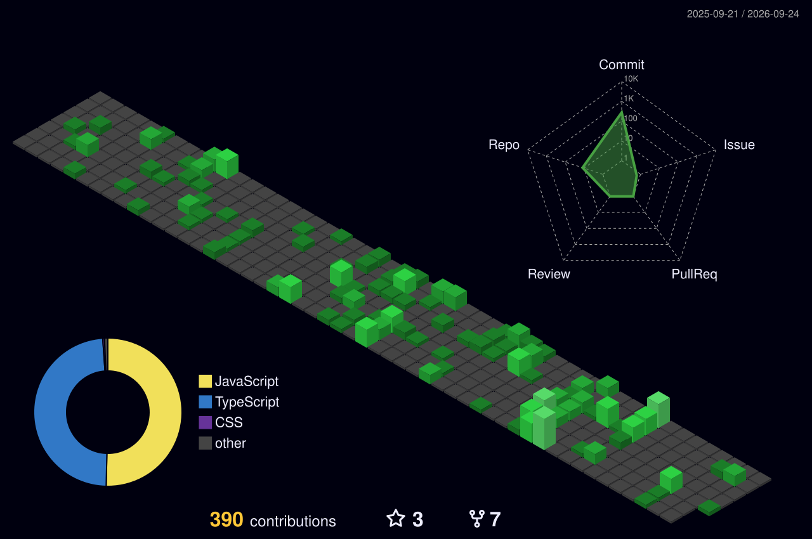

<!-- PHASE 1: BANNER -->
<picture>
  <source media="(prefers-color-scheme: dark)" srcset="./Banner/dark.svg">
  <source media="(prefers-color-scheme: light)" srcset="./Banner/light.svg">
  
</picture>

<!-- PHASE 2: STATS CARDS -->
## 📊 GitHub Stats

 
  <picture>
    <source media="(prefers-color-scheme: dark)" srcset="https://streak-stats.demolab.com?user=himanshu-sheetlani&theme=github-dark-blue&background=0A101F&stroke=22D3EE&ring=22D3EE&fire=10B981&currStreakLabel=22D3EE&sideLabels=94A3B8&currStreakNum=F8FAFC&sideNums=F8FAFC&hide_border=true&card_width=1180">
    <source media="(prefers-color-scheme: light)" srcset="https://streak-stats.demolab.com?user=himanshu-sheetlani&theme=github-dark-blue&background=0A101F&stroke=22D3EE&ring=0891B2&fire=10B981&currStreakLabel=0891B2&sideLabels=94A3B8&currStreakNum=F8FAFC&sideNums=F8FAFC&hide_border=true&card_width=1180">
    
  </picture>

  

  <picture>
    <source media="(prefers-color-scheme: dark)" srcset="https://github-readme-badges.netlify.app/api?username=himanshu-sheetlani&show_icons=true&count_private=true&bg_color=0A101F&title_color=22D3EE&icon_color=22D3EE&text_color=F1F5F9&hide_border=true&card_width=500">
    <source media="(prefers-color-scheme: light)" srcset="https://github-readme-badges.netlify.app/api?username=himanshu-sheetlani&show_icons=true&count_private=true&bg_color=F8FAFC&title_color=0891B2&icon_color=0891B2&text_color=0F172A&hide_border=true&card_width=500">
    
  </picture>
  <picture>
    <source media="(prefers-color-scheme: dark)" srcset="https://github-readme-badges.netlify.app/api/top-langs?username=himanshu-sheetlani&bg_color=0A101F&langs_count=8&title_color=22D3EE&icon_color=22D3EE&text_color=F1F5F9&hide_border=true&layout=compact&card_width=500">
    <source media="(prefers-color-scheme: light)" srcset="https://github-readme-badges.netlify.app/api/top-langs?username=himanshu-sheetlani&bg_color=F8FAFC&langs_count=8&title_color=0891B2&icon_color=0891B2&text_color=0F172A&hide_border=true&layout=compact&card_width=500">
    
  </picture>

<!-- PHASE 3: CONTRIBUTION 3D GRAPH -->
## 🌐 Contribution Graph

<picture>
  <source media="(prefers-color-scheme: dark)" srcset="./profile-3d-contrib/profile-night-green.svg" />
  <source media="(prefers-color-scheme: light)" srcset="./profile-3d-contrib/profile-green.svg" />
  
</picture>

<!-- PHASE 4: SOCIAL BADGES -->
## 🔗 Connect with Me

&nbsp;&nbsp;
&nbsp;&nbsp;
&nbsp;&nbsp;

<!-- PHASE 5: TECH STACK -->
## 💻 Tech Stack

### Frontend

### Backend

### Databases

### DevOps & Cloud

### Other Tools

